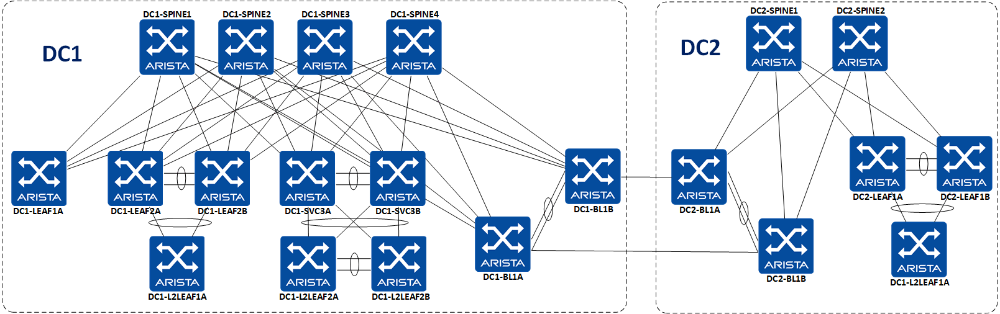

 

# ipSpace Webinar with Ansible Arista Validated Design

__Content used for ipSpace webinar / Work In Progress__

<!-- @import "[TOC]" {cmd="toc" depthFrom=1 depthTo=6 orderedList=false} -->

<!-- code_chunk_output -->

- [ipSpace Webinar with Ansible Arista Validated Design](#ipspace-webinar-with-ansible-arista-validated-design)
  - [Lab Topology](#lab-topology)
  - [Quick Start](#quick-start)
  - [Requirements](#requirements)
  - [Step by Step demo](#step-by-step-demo)
    - [Provision border-leaf devices](#provision-border-leaf-devices)
      - [DC1 Inventory file](#dc1-inventory-file)
      - [DC2 Inventory file](#dc2-inventory-file)
      - [DC1 Fabric in group_vars](#dc1-fabric-in-group_vars)
      - [DC2 Fabric in group_vars](#dc2-fabric-in-group_vars)
      - [Run playbooks](#run-playbooks)
    - [Apply DCI configuration to border-leaf devices](#apply-dci-configuration-to-border-leaf-devices)
      - [Configure DCI on DC1](#configure-dci-on-dc1)
      - [Insert role for DCI in DC2](#insert-role-for-dci-in-dc2)
    - [Validate EOS device states](#validate-eos-device-states)

<!-- /code_chunk_output -->

Repository provides modules and roles to build an EVPN/VXLAN fabric using Ansible to build and deploy configuration to devices.

Devices configuration are based on [Arista EVPN Design Guide](https://www.arista.com/en/solutions/design-guides) and cover a generic Unified Cloud Network environment.


## Lab Topology

The Lab topology consists of four spines, seven L3 leafs and and three L2 Leafs, deployed on vEOS-LAB.



## Quick Start

```shell
# Start a pre-configured shell using docker
$ make shell

# Install AVD and CVP collection
$ make install

# Edit Inventory file
$ vim inventories/DC{1|2}/inventory.yml

# Edit fabric variables
# Change values to point to your own information
$ vim inventories/DC{1|2}/group_vars/DC1_FABRIC.yml

# Run ansible playbooks

# Build EOS configuration for both DCs:
$ ansible-playbook playbooks/dc1-fabric-deploy-cvp.yml --tags build -i inventories/DC1/inventory.yml
$ ansible-playbook playbooks/dc2-fabric-deploy-cvp.yml --tags build -i inventories/DC2/inventory.yml

# Deploy configuration to both DCs:
# Tasks on CV must be executed manually
$ ansible-playbook playbooks/dc1-fabric-deploy-eapi.yml --tags provision -i inventories/DC1/inventory.yml
$ ansible-playbook playbooks/dc2-fabric-deploy-eapi.yml --tags provision -i inventories/DC2/inventory.yml

# Validate EOS state
$ ansible-playbook playbooks/dc1-fabric-validate-state.yml -i inventories/DC1/inventory.yml
$ ansible-playbook playbooks/dc2-fabric-validate-state.yml -i inventories/DC2/inventory.yml
```

## Requirements

- Docker to run [pre-configured shell](https://www.avd.sh/docs/installation/setup-environement/)
- EOS Topology:
  - 2 different fabrics running with standard AVD configuration
  - All topologies registered in a single Cloudvision instance
  - Border Leaves registered in CVP and still in ZTP mode (part of undefined container)
- A single Cloudvision instance up and running

## Step by Step demo

This section will go through step-by-step commands used during the webinar. It does not cover initial fabric provisioning.

### Provision border-leaf devices

Edit inventories to uncomment border-leaf devices

#### DC1 Inventory file

Edit [inventory.yml](inventories/dc1/../DC1/inventory.yml)

```yaml
all:
  children:
    AVD_LAB:
      children:
        DC1_FABRIC:
          children:
[...]
                DC1_BL1:
                  hosts:
                    DC1-BL1A:
                      ansible_host: 192.168.200.110
                    DC1-BL1B:
                      ansible_host: 192.168.200.111
```

#### DC2 Inventory file

Edit [inventory.yml](inventories/dc1/../DC2/inventory.yml)

```yaml
all:
  children:
    AVD_LAB:
      children:
        DC2_FABRIC:
          children:
[...]
                DC2_BL1:
                  hosts:
                    DC2-BL1A:
                      ansible_host: 192.168.200.155
                    DC2-BL1B:
                      ansible_host: 192.168.200.156
```

Then, we must uncomment group_vars related to Border Leaf devices

#### DC1 Fabric in group_vars

Edit [DC1_FABRIC.yml](inventories/dc1/../DC1/group_vars/DC1_FABRIC.yml)

```yaml
l3leaf:
[...]
    DC1_BL1:
      bgp_as: 65104
      filter:
        tenants: [ all ]
        tags: [ wan ]
      nodes:
        DC1-BL1A:
          id: 6
          mgmt_ip: 192.168.200.110/24
          spine_interfaces: [ Ethernet6, Ethernet6, Ethernet6, Ethernet6 ]
        DC1-BL1B:
          id: 7
          mgmt_ip: 192.168.200.111/24
          spine_interfaces: [ Ethernet7, Ethernet7, Ethernet7, Ethernet7 ]
```

#### DC2 Fabric in group_vars

Edit [DC2_FABRIC.yml](inventories/dc1/../DC2/group_vars/DC2_FABRIC.yml)

```yaml
l3leaf:
[...]
    DC2_BL1:
      bgp_as: 65202
      filter:
        tenants: [ all ]
        tags: [ wan ]
      nodes:
        DC2-BL1A:
          id: 3
          mgmt_ip: 192.168.200.155/24
          spine_interfaces: [ Ethernet3, Ethernet3 ]
        DC2-BL1B:
          id: 4
          mgmt_ip: 192.168.200.156/24
          spine_interfaces: [ Ethernet4, Ethernet4 ]
```

#### Run playbooks

- Generate EOS configuration and documentation

_Playbook_: [dc{1|2}-fabric-deploy-cvp.yml](playbooks/dc1-fabric-deploy-cvp.yml)

```shell
# Shortcut command
$ make dc-build

# Ansible command
$ ansible-playbook playbooks/dc1-fabric-deploy-cvp.yml --tags build -i inventories/DC1/inventory.yml
$ ansible-playbook playbooks/dc2-fabric-deploy-cvp.yml --tags build -i inventories/DC2/inventory.yml
```

- Provision changes on Cloudvision

_Playbook_: [dc{1|2}-fabric-deploy-cvp.yml](playbooks/dc1-fabric-deploy-cvp.yml)

```shell
# Shortcut command
$ make dc-provision

# Ansible command
$ ansible-playbook playbooks/dc1-fabric-deploy-cvp.yml --tags provision -i inventories/DC1/inventory.yml
$ ansible-playbook playbooks/dc2-fabric-deploy-cvp.yml --tags provision -i inventories/DC2/inventory.yml
```

### Apply DCI configuration to border-leaf devices

Now our border leaves have been included in their respective fabric but DCI configuration is not applied yet. This section will show you how to do that.

Because AVD provides 2 different approaches, we will detail both of them:

- Upload configlets and configure AVD to attach them to devices (use-case for DC1)
- Insert an intermediate role to generate DCI configuration (use-case for DC2)


#### Configure DCI on DC1

Configlets are stored in [inventories/dc1/configlets/](inventories/dc1/configlets/) folder

- Upload configlet on Cloudvision

```shell
$ ansible-playbook playbooks/dc1-configlet-upload.yml -i inventories/DC1/inventory.yml
```

- Update border leaf configuration in AVD

Edit [DC1_FABRIC.yml](inventories/dc1/../DC1/group_vars/DC1_FABRIC.yml)

```yaml
cv_configlets:
  devices:
    DC1-BL1A:
      - DCI-DC1-BL1A
    DC1-BL1B:
      - DCI-DC1-BL1B
```

- Provision changes on Cloudvision

_Playbook_: [dc1-fabric-deploy-cvp.yml](playbooks/dc1-fabric-deploy-cvp.yml)

```shell
# Shortcut command
$ make dc1-build
$ make dc1-provision

# Ansible command
$ ansible-playbook playbooks/dc1-fabric-deploy-cvp.yml --tags build -i inventories/DC1/inventory.yml
$ ansible-playbook playbooks/dc1-fabric-deploy-cvp.yml --tags provision -i inventories/DC1/inventory.yml
```

#### Insert role for DCI in DC2

- Configure [`host_vars`](inventories/DC2/host_vars/DC2-BL1A.yml) for border leaves on DC2

```yaml
---
dci_ethernet_interfaces:
    Ethernet10:
      peer: DC1-BL1A
      peer_interface: Ethernet10
      peer_type: leaf
      description: P2P_LINK_TO_DC1-BL1A_Ethernet10
      mtu: 1500
      type: routed
      ip_address: 172.31.0.1/31
dci_bgp:
  neighbors:
    172.31.0.0:
      peer_group: DCI-IPv4-UNDERLAY-PEERS
    192.168.251.10:
      peer_group: DCI-EVPN-OVERLAY-PEERS
  peer_groups:
      DCI-IPv4-UNDERLAY-PEERS:
        type: ipv4
        remote_as: 65104
        # password: "AQQvKeimxJu+uGQ/yYvv9w=="
        maximum_routes: 12000
        send_community: true
      DCI-EVPN-OVERLAY-PEERS:
        type: evpn
        remote_as: 65104
        update_source: Loopback0
        bfd: true
        ebgp_multihop: 3
        # password: "q+VNViP5i4rVjW1cxFv2wA=="
        send_community: true
        maximum_routes: 0
  address_family_evpn:
    peer_groups:
      DCI-EVPN-OVERLAY-PEERS:
        activate: true
  address_family_ipv4:
    peer_groups:
      DCI-IPv4-UNDERLAY-PEERS:
        activate: true
```

> Do the same things for DC2-BL1B

- Check playbook runs [`eos_dci`](roles/eos_dci/README.md) role

_Playbook_: [dc2-fabric-deploy-cvp.yml](playbooks/dc2-fabric-deploy-cvp.yml)

```yaml
---
- name: Build Switch configuration
  hosts: DC2_FABRIC
  connection: local
  gather_facts: no

  tasks:

    - name: include global_vars
      tags: [build, provision]
      include_vars: "{{ item }}"
      with_items:
        - "../global_vars/AVD_LAB.yml"
        - "../global_vars/EOS.yml"

    - name: generate intented variables
      tags: [build]
      import_role:
         name: arista.avd.eos_l3ls_evpn

    - name: generate intented DCI variables
      tags: [build, provision]
      import_role:
         name: eos_dci

    - name: generate device intended config and documention
      tags: [build]
      import_role:
         name: arista.avd.eos_cli_config_gen
```

### Validate EOS device states

In this section, we will check our EOS devices are configured based on __structured-config__ generated with the build phase.

_Playbook_: [dc{1|2}-fabric-validate-state.yml](playbooks/dc1-fabric-validate-state.yml)

```shell
# Shortcut command
$ make dc-validate-state

# Ansible command
$ ansible-playbook playbooks/dc1-fabric-validate-state.yml -i inventories/DC1/inventory.yml
$ ansible-playbook playbooks/dc2-fabric-validate-state.yml -i inventories/DC2/inventory.yml
```
